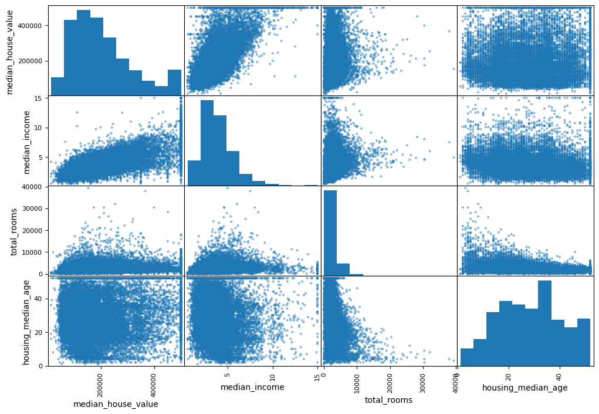

# Real Estate Price Prediction

This project focuses on predicting real estate prices using a housing dataset. The workflow involves data loading, exploratory data analysis, visualization, data preprocessing, and training various machine learning models.

## Dataset Description

The dataset contains various attributes related to housing districts, likely from California. Key features include:

*   **`longitude`**: A measure of how far west a house is.
*   **`latitude`**: A measure of how far north a house is.
*   **`housing_median_age`**: Median age of a house within a block.
*   **`total_rooms`**: Total number of rooms within a block.
*   **`total_bedrooms`**: Total number of bedrooms within a block.
*   **`population`**: Total population within a block.
*   **`households`**: Total number of households within a block.
*   **`median_income`**: Median income for households within a block.
*   **`median_house_value`**: Median house value for households within a block (the target variable).
*   **`ocean_proximity`**: Proximity to the ocean (categorical feature).

## Visualizations and Insights

Here are some of the key visualizations and the insights derived from them:

### Histograms of Numerical Features

*   **Insight**: Histograms reveal the distribution of numerical attributes. `median_income`, `housing_median_age`, and `median_house_value` show signs of capping. Most distributions are skewed, suggesting the need for potential transformations during preprocessing.

### Geographic Scatter Plot with Population and House Value

*   **Insight**: This scatter plot of `longitude` vs. `latitude`, with color representing `median_house_value` and size representing `population`, clearly indicates that housing values are generally higher near the coast (especially in Southern California) and in more densely populated areas.

### Scatter Matrix

*   **Insight**: The scatter matrix displays relationships between `median_house_value`, `median_income`, `total_rooms`, and `housing_median_age`. A strong positive correlation is observed between `median_income` and `median_house_value`.

### Box Plot of Median House Value by Ocean Proximity

*   **Insight**: This box plot shows the distribution of `median_house_value` across different `ocean_proximity` categories. Houses `NEAR BAY` and `ISLAND` tend to have higher median values, while `INLAND` houses have lower values.

## Machine Learning Model Insights

The project explored several machine learning models for predicting `median_house_value`:

*   **Linear Regression**: Served as a baseline, providing an initial RMSE of approximately 68,600.
*   **Decision Tree Regressor**: Overfit the training data (RMSE of 0.0), but cross-validation revealed a mean RMSE of around 71,200.
*   **Random Forest Regressor**: Demonstrated better performance with a mean cross-validation RMSE of approximately 49,600, showing improved robustness.
*   **Hyperparameter Tuning**: Both Grid Search and Randomized Search were used to optimize the Random Forest model's hyperparameters. The optimal parameters found included `preprocessing__geo__n_clusters=48` and `random_forest__max_features=7`.
*   **Feature Importances**: `median_income`, `ocean_proximity` categories (e.g., `_INLAND`, `<1H OCEAN`), and the generated geographic cluster features (`geo` features) were identified as the most important predictors.
*   **Final Model Performance**: The best-performing Random Forest model, with tuned hyperparameters, achieved an RMSE of approximately 41,445 on the unseen test set, along with a calculated confidence interval, indicating good generalization.
